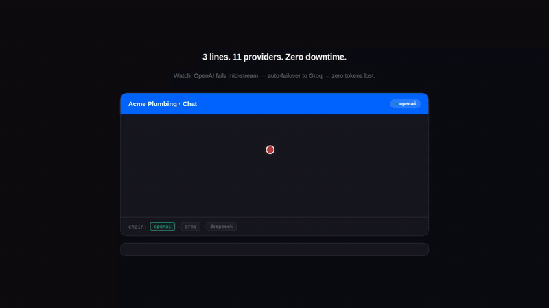

<p align="center">
  
</p>

<h1 align="center">ChatbotLite</h1>

<p align="center">
  <strong>AI chatbot in 3 lines of code.</strong><br>
  Stop burning tokens building chatbots from scratch. We did it for you.
</p>

<p align="center">
  <a href="https://www.npmjs.com/package/chatbotlite"></a>
  <a href="LICENSE"></a>
</p>

<p align="center">
  <a href="https://chatbotlite-demos.vercel.app">Live demos</a> ·
  <a href="https://chatbotlite-demos.vercel.app/llms-full.txt">API Reference</a> ·
  <a href="ROADMAP.md">Roadmap</a> ·
  <a href="SKILL_MARKER_SPEC.md">SKILL Protocol</a>
</p>

---

## 3 lines to chatbot

```tsx
import { ChatWidget } from "chatbotlite/react";

<ChatWidget endpoint="/api/chat" title="Acme Plumbing" theme={{ primary: "#1e3a8a" }} />
```

Or plain HTML (Shopify, WordPress, Webflow, anywhere):

```html
<script src="https://unpkg.com/chatbotlite/dist/embed.global.js"></script>
<script>
  chatbotlite.mount({ endpoint: "/api/chat", title: "Acme Plumbing" });
</script>
```

Server (`/api/chat`):

```ts
import { ChatBot } from "chatbotlite/client";
import { knowledgeFromFile } from "chatbotlite/node";

const bot = new ChatBot({
  knowledge: knowledgeFromFile("./knowledge.md"),
  providers: { keys: { openai: process.env.OPENAI_API_KEY } }
});

export async function POST(req: Request) {
  const { message, transcript } = await req.json();
  return new Response(await bot.replyStream(message, { history: transcript }), {
    headers: { "Content-Type": "text/event-stream" }
  });
}
```

## Zero downtime. Auto-failover.

Add multiple provider keys. If one fails mid-stream, the next picks up. Zero tokens lost.

<p align="center">
  
</p>

11 providers: OpenAI, Anthropic, Groq, DeepSeek, Gemini, Mistral, Fireworks, Cerebras, SambaNova, OpenRouter, Moonshot.

---

## What's in the box

| | |
|--|--|
| **3 lines** | React component or `<script>` tag. No build step needed. |
| **11 LLM providers** | Auto-failover chain. OpenAI today, Groq tomorrow, local Ollama for testing. |
| **Markdown knowledge** | Write services, hours, pricing in a `.md` file. No vector DB. Anti-hallucination guards built-in. |
| **13 adapters** | Stripe, PayPal, Calendly, Cal.com, Formspree, and 8 more. Paste a URL, done. |
| **Tool cards** | Bot triggers payment, scheduling, file upload, picker buttons inline in chat. |
| **Session persistence** | Pluggable `ChatStorage` interface. localStorage default, wire to your own DB. |
| **Streaming** | SSE tokens render as the LLM types. Streaming cursor in brand color. |
| **Defense in depth** | Phrase redlines + optional LLM judges for input/output safety. |
| **$0/mo forever** | Apache 2.0. No SaaS subscription. No per-conversation pricing. |

---

## Adapters (v0.7)

URL-only adapters. Customer pastes a URL, we open it. Zero backend, zero API keys.

```tsx
import { stripeLink, calendlyUrl } from "chatbotlite/adapters";

<ChatWidget
  endpoint="/api/chat"
  tools={{
    requestPayment: stripeLink("https://buy.stripe.com/your-link"),
    scheduleCallback: calendlyUrl("https://calendly.com/your-page/30min"),
  }}
/>
```

**Payment**: `stripeLink`, `paypalLink`, `squareLink`, `lemonSqueezyLink`, `gumroadLink`
**Scheduling**: `calendlyUrl`, `calcomUrl`, `savvycalUrl`, `acuityUrl`, `msBookingsUrl`, `googleCalendarApptUrl`
**Lead capture**: `formspreeUrl`, `tallyUrl`

---

## Tool cards

The bot emits `[SKILL:...]` markers. The widget renders interactive cards.

```
[SKILL:requestPayment amount=4250 currency="cad" reason="deposit"]
[SKILL:scheduleCallback durationMin=15 timezone="America/Vancouver"]
[SKILL:uploadForReview purpose="T4 slip" accept="image/*,application/pdf"]
[SKILL:pickerMessage prompt="Service type?" options="Inspection,Repair,Emergency"]
```

See the full [SKILL Marker Protocol spec](SKILL_MARKER_SPEC.md).

---

## Provider config

```ts
providers: {
  keys: {
    openai:   process.env.OPENAI_API_KEY,
    groq:     process.env.GROQ_API_KEY,
    deepseek: process.env.DEEPSEEK_API_KEY,
  },
  chain: [
    { provider: "openai",   model: "gpt-4o-mini" },
    { provider: "groq",     model: "llama-3.3-70b-versatile" },
    { provider: "deepseek", model: "deepseek-chat" }
  ]
}
```

Top-to-bottom = priority. Auto-retry on 429/5xx, then fall to next.

---

## Live demos

6 verticals, all running on the same npm package: [chatbotlite-demos.vercel.app](https://chatbotlite-demos.vercel.app)

| Vertical | Demo |
|---|---|
| E-commerce | [Bayside Coffee Co.](https://chatbotlite-demos.vercel.app/shopify-store/) |
| Service business | [Acme Plumbing](https://chatbotlite-demos.vercel.app/plumber/) |
| Hospitality | [Bella Italia](https://chatbotlite-demos.vercel.app/restaurant/) |
| Healthcare | [Smile Care Dental](https://chatbotlite-demos.vercel.app/dentist/) |
| Professional services | [MaxTax](https://chatbotlite-demos.vercel.app/tax-prep/) |
| Wellness | [Sunrise Yoga](https://chatbotlite-demos.vercel.app/yoga-studio/) |

---

## Documentation

- [Full API Reference](https://chatbotlite-demos.vercel.app/llms-full.txt) (35KB, LLM-readable)
- [llms.txt summary](https://chatbotlite-demos.vercel.app/llms.txt)
- [SKILL Marker Protocol](SKILL_MARKER_SPEC.md)
- [Roadmap](ROADMAP.md)
- [Design System](DESIGN_SYSTEM.md)
- [Strategy](STRATEGY.md)

---

## License

Apache 2.0. Use it for whatever, commercial too.

---

Built by [agents-io](https://github.com/agents-io).
