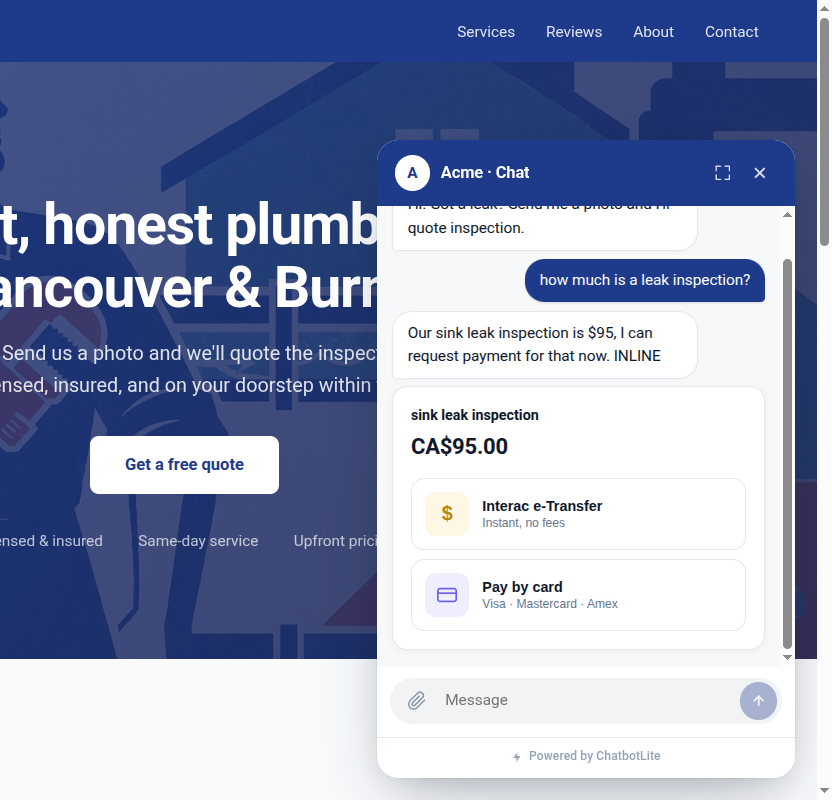

<p align="center">
  
</p>

<h1 align="center">ChatbotLite</h1>

<p align="center">
  <strong>3行代码，接入AI客服。</strong><br>
  别再从零搭聊天机器人了，我们替你做好了。<br>
  <sub>专为独立开发者和中小企业网站设计。不用花三周集成，今天就能上线。</sub>
</p>

<p align="center">
  
</p>

<p align="center">
  <a href="https://chatbotlite-demos.vercel.app"><strong>▶ 在线体验 — 6个行业演示、安装代码、方案对比</strong></a>
</p>

<p align="center">
  <a href="https://github.com/agents-io/chatbotlite/stargazers"></a>
  <a href="https://www.npmjs.com/package/chatbotlite"></a>
  <a href="https://www.npmjs.com/package/chatbotlite"></a>
  <a href="https://bundlephobia.com/package/chatbotlite"></a>
  <a href="https://github.com/agents-io/chatbotlite/actions/workflows/test.yml"></a>
  <a href="LICENSE"></a>
</p>

<p align="center">
  <a href="https://chatbotlite-demos.vercel.app">在线演示</a> ·
  <a href="https://chatbotlite-demos.vercel.app/llms-full.txt">API 文档</a> ·
  <a href="ROADMAP.md">路线图</a> ·
  <a href="SKILL_MARKER_SPEC.md">SKILL 协议</a> ·
  <a href="README.md">English</a> ·
  <a href="README.ja.md">日本語</a>
</p>

---

## 3行接入

```tsx
import { ChatWidget } from "chatbotlite/react";

<ChatWidget endpoint="/api/chat" title="老王水电维修" theme={{ primary: "#1e3a8a" }} />
```

不用React也行，一个script标签搞定（Shopify、WordPress、Webflow、任何静态页面）：

```html
<script src="https://unpkg.com/chatbotlite/dist/embed.global.js"></script>
<script>
  chatbotlite.mount({ endpoint: "/api/chat", title: "老王水电维修" });
</script>
```

服务端（`/api/chat`）：

```ts
import { ChatBot } from "chatbotlite/client";
import { knowledgeFromFile } from "chatbotlite/node";

const bot = new ChatBot({
  knowledge: knowledgeFromFile("./knowledge.md"),
  providers: { keys: { openai: process.env.OPENAI_API_KEY } }
});

export async function POST(req: Request) {
  const { message, transcript } = await req.json();
  return new Response(await bot.replyStream(message, { history: transcript }), {
    headers: { "Content-Type": "text/event-stream" }
  });
}
```

## 零停机，自动切换

配多个provider key就行。某个provider流式返回中途出错，下一个自动接管，重新生成回复。token级的中途续传在0.8版本计划中。

<p align="center">
  
</p>

支持10家provider：OpenAI、Groq、DeepSeek、Gemini、Mistral、Fireworks、Cerebras、SambaNova、OpenRouter、Moonshot。

---

## 能做什么

| | |
|--|--|
| **3行接入** | React组件或`<script>`标签，不需要构建步骤。 |
| **10家LLM provider** | 自动故障转移链。今天用OpenAI，明天换Groq，本地测试用Ollama。 |
| **Markdown知识库** | 把服务内容、营业时间、价格写在`.md`文件里就行。不需要向量数据库，内置防幻觉机制。 |
| **13个适配器** | Stripe、PayPal、Calendly、Cal.com、Formspree等。贴个URL就能用。 |
| **工具卡片** | 机器人在聊天中直接触发支付、预约、文件上传、选项按钮。 |
| **会话持久化** | 可插拔的`ChatStorage`接口，默认localStorage，可以换成你自己的数据库。 |
| **流式输出** | SSE token随LLM生成实时渲染，品牌色光标跟随。 |
| **安全防护** | 关键词拦截 + 可选LLM审查，保障输入输出安全。 |
| **永久免费** | Apache 2.0开源。没有SaaS订阅费，没有按对话收费。 |

---

## 适配器（v0.7）

纯URL适配器。贴一个URL进去，就能用。不需要后端、不需要API key。

```tsx
import { stripeLink, calendlyUrl } from "chatbotlite/adapters";

<ChatWidget
  endpoint="/api/chat"
  tools={{
    requestPayment: stripeLink("https://buy.stripe.com/your-link"),
    scheduleCallback: calendlyUrl("https://calendly.com/your-page/30min"),
  }}
/>
```

**支付**: `stripeLink`, `paypalLink`, `squareLink`, `lemonSqueezyLink`, `gumroadLink`
**预约**: `calendlyUrl`, `calcomUrl`, `savvycalUrl`, `acuityUrl`, `msBookingsUrl`, `googleCalendarApptUrl`
**线索获取**: `formspreeUrl`, `tallyUrl`

---

## 工具卡片

机器人输出`[SKILL:...]`标记后，组件会渲染对应的交互卡片。

```
[SKILL:requestPayment amount=4250 currency="cny" reason="检测费"]
[SKILL:scheduleCallback durationMin=15 timezone="Asia/Shanghai"]
[SKILL:uploadForReview purpose="发票" accept="image/*,application/pdf"]
[SKILL:pickerMessage prompt="您需要什么服务？" options="检测,维修,紧急上门"]
```

完整规范见 [SKILL标记协议](SKILL_MARKER_SPEC.md)。

---

## Provider 配置

```ts
providers: {
  keys: {
    openai:   process.env.OPENAI_API_KEY,
    groq:     process.env.GROQ_API_KEY,
    deepseek: process.env.DEEPSEEK_API_KEY,
  },
  chain: [
    { provider: "openai",   model: "gpt-4o-mini" },
    { provider: "groq",     model: "llama-3.3-70b-versatile" },
    { provider: "deepseek", model: "deepseek-chat" }
  ]
}
```

从上到下 = 优先级。429/5xx自动重试，失败后切换到下一个。

---

## 在线演示

6个行业，用的是同一个npm包：[chatbotlite-demos.vercel.app](https://chatbotlite-demos.vercel.app)

| 行业 | 演示 |
|---|---|
| 电商 | [Bayside Coffee Co.](https://chatbotlite-demos.vercel.app/shopify-store/) |
| 服务业 | [Acme Plumbing](https://chatbotlite-demos.vercel.app/plumber/) |
| 餐饮 | [Bella Italia](https://chatbotlite-demos.vercel.app/restaurant/) |
| 医疗 | [Smile Care Dental](https://chatbotlite-demos.vercel.app/dentist/) |
| 专业服务 | [MaxTax](https://chatbotlite-demos.vercel.app/tax-prep/) |
| 健康 | [Sunrise Yoga](https://chatbotlite-demos.vercel.app/yoga-studio/) |

---

## 文档

- [完整API文档](https://chatbotlite-demos.vercel.app/llms-full.txt)（35KB，LLM可读）
- [llms.txt 摘要](https://chatbotlite-demos.vercel.app/llms.txt)
- [SKILL标记协议](SKILL_MARKER_SPEC.md)
- [路线图](ROADMAP.md)
- [设计系统](DESIGN_SYSTEM.md)

---

## 参与贡献

欢迎PR。合并标准见 [CONTRIBUTING.md](CONTRIBUTING.md)。

安全相关问题请查看 [SECURITY.md](SECURITY.md)，请不要直接开公开Issue。

## ⭐ 如果帮你省了一个周末

点个star，让下一个本来要花整个周末重写聊天组件的开发者也能找到。开源就是这么回事，举手之劳。

[★ 去GitHub点star](https://github.com/agents-io/chatbotlite)

## 开源协议

Apache 2.0。商用也没问题。

---

由 [agents-io](https://github.com/agents-io) 开发。同团队其他项目：[Cross-Code Organizer](https://github.com/mcpware/cross-code-organizer)（328★ Claude Code / Codex CLI / MCP 配置管理面板）· [PokeClaw](https://github.com/agents-io/pokeclaw)（875★）。
